<div align='center'>


# Runfile - command line for your projects

[](https://badge.fury.io/rb/runfile)
[](https://github.com/DannyBen/runfile/actions?query=workflow%3ATest)
[](https://codeclimate.com/github/DannyBen/runfile/maintainability)

---

A beautiful command line application framework  
Rake-inspired - Docopt inside

---

</div>

**Runfile** lets you create command line applications in a way similar 
to [Rake](https://github.com/ruby/rake), but with the full power of 
[Docopt](http://docopt.org/) command line options.

You create a `runfile`, and execute commands with 
`run command arguments -and --flags`.

Runfile is designed primarily for Ruby developers, but if you need to add a 
command line "toolbelt" for your projects, you can use it regardless.

## Pre-release Notice

Note that this README describes the not yet released 1.0.0 version.  
See [runfile.dannyb.co](https://runfile.dannyb.co/) for the stable release
documentation.

During the pre-release phase, the `run` executable is called `runn` instead, 
to allow running both the stable and pre-release version side by side.

## Demo



## Install

```shell
$ gem install runfile --pre
```

## Quick Start

```shell
$ run new        # create a new runfile
$ run --help     # show the usage patterns
$ vi runfile     # edit the runfile
```

## Example

A simple `runfile` looks like this. You can get this template by running `run
new` ()in a directory without other runfiles).

```ruby
title   'Greeter'
summary 'A sample runfile'

usage  'hello [NAME --shout]'
help   'Say hello'
option '--shout, -s', 'Greet louder'
action 'hello' do |args|
  name = args['NAME'] || 'You...'
  message = "Hello #{name}"
  message = "#{message.upcase}!" if args['--shout']

  say "gu`#{message}`"
end
```

You can then run it by executing this command:

```shell
$ run hello Luke
Hello Luke
```

It will behave in the same way you expect any standard command line interface to
behave, 

```shell
# Show usage summary
$ run
Usage:
  run hello [NAME --shout]
  run (--help | -h)

# Show detailed help
$ run --help
Greeter

  A sample runfile

Usage:
  run hello [NAME --shout]
  run (--help | -h)

Commands:
  hello
    Say hello

Options:
  --shout, -s
    Greet louder

  --help, -h
    Show this message
```

## Examples

You can learn almost everything there is to know about runfile from the
[examples](https://github.com/DannyBen/runfile/tree/master/examples#readme).

You can get any of these examples directly in your terminal by running:

```shell
$ run example --help
```

## Documentation

For a more formal documentation, see the [User Guide](https://runfile.dannyb.co/).

Note that the current user guide is for the stable version 0.12.0.

## Breaking Changes in 1.0.0

If you are using a version earlier than 1.0, note that the upcoming release
1.0.0 includes some breaking changes. You can read more about them in[this Pull
Request](https://github.com/DannyBen/runfile/pull/50).

### Upgrading to 1.0.0

### No more `.runfile` config

If you have used the multi-runfile config file, this no longer exists.
Use a standard `runfile` instead, along with the `import` directive.

### No more `action :global`

If you have used the `action :global do` notation, this is replaced with the
simpler use `action do` instead. Also, there is no more need for
empty `usage ''`, just delete it if you have it in your runfiles.

### No more `execute` directive

If you have used it to cross-call other actions, it is no longer available. As
an alternative, you can define common code in separate classes and `require`
them, or use the new `helpers` directive to define functions that will be
available to all actions.

### No more need for `trap(:INT)`

If your old runfiles trap the `Interrupt` signal, there i no longer a need to
do so, as it is trapped by default.

### Colsole is included

If your runfiles `required` and `include` Colsole, there is no longer a need to 
do it. Colsole is bundled and available in actions.

### Long flags before short flags

This is a cosmetic change for consistency. All generated output shows long flags
before short flags `--force, -f` instead of `-f, --force`. Update your custom
`usage` directives accordingly.

### Examples no longer add implicit 'run'

If you were using the `example` directive, it will no longer add the initial
`run` in front of your examples. Add it yourself. This is intended to allow
providing more elaborate examples.

### RunfileTasks

The `RunfileTasks` gem is also released as a pre-release, if you are using it
make sure to install the latest release candidate.

## Contributing / Support

If you experience any issue, have a question or a suggestion, or if you wish to
contribute, feel free to
[open an issue](https://github.com/DannyBen/runfile/issues).
