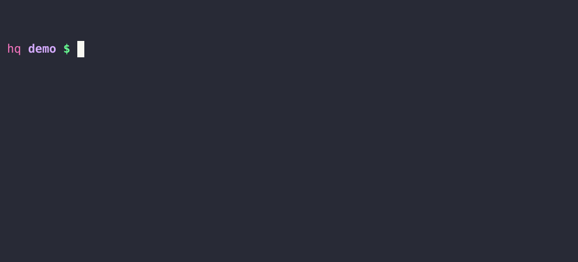

<div align='center'>


# Runfile - command line for your projects

---

A beautiful command line utility builder  
Rake-inspired ✦ Docopt inside  
**[runfile.dannyb.co](https://runfile.dannyb.co)**

---

</div>


**Runfile** lets you create command line tools in a way similar to
[Rake](https://github.com/ruby/rake), but with the full power of 
[Docopt](http://docopt.org/) command line options.

You create a `runfile`, and execute commands with 
`run command arguments -and --flags`.

Runfile is designed primarily for Ruby developers, but if you need to add a 
command line "toolbelt" for your projects, you can use it regardless.

## Demo



## Install

```shell
$ gem install runfile
```

## Quick Start

```shell
$ run new        # create a new runfile
$ run --help     # show the usage patterns
$ vi runfile     # edit the runfile
```

## Example

A simple `runfile` looks like this. You can get this template by running 
`run new` (in a directory without other runfiles).

```ruby
title   'Greeter'
summary 'A sample runfile'

usage  'hello [NAME --shout]'
help   'Say hello'
option '--shout, -s', 'Greet louder'
action 'hello' do |args|
  name = args['NAME'] || 'You...'
  message = "Hello #{name}"
  message = "#{message.upcase}!" if args['--shout']

  say "gu`#{message}`"
end
```

You can then run it by executing this command:

```shell
$ run hello Luke
Hello Luke
```

It will behave in the same way you expect any standard command line interface to
behave, 

```shell
# Show usage summary
$ run
Usage:
  run hello [NAME --shout]
  run (--help | -h)

# Show detailed help
$ run --help
Greeter

  A sample runfile

Usage:
  run hello [NAME --shout]
  run (--help | -h)

Commands:
  hello
    Say hello

Options:
  --shout, -s
    Greet louder

  --help, -h
    Show this message
```

### More Examples

You can learn almost everything there is to know about runfile from the
[examples](https://github.com/DannyBen/runfile/tree/master/examples#readme).

You can get any of these examples directly in your terminal by running:

```shell
$ run example --help
```

## Documentation

For a more formal documentation, see the [User Guide](https://runfile.dannyb.co/).

## Contributing / Support

If you experience any issue, have a question or a suggestion, or if you wish to
contribute, feel free to
[open an issue](https://github.com/DannyBen/runfile/issues).
